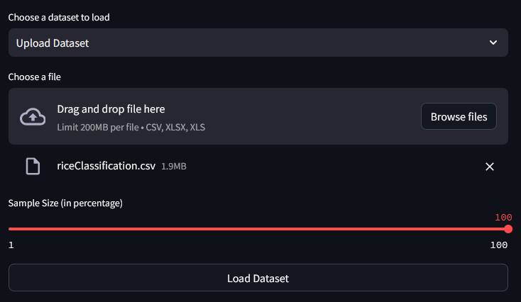
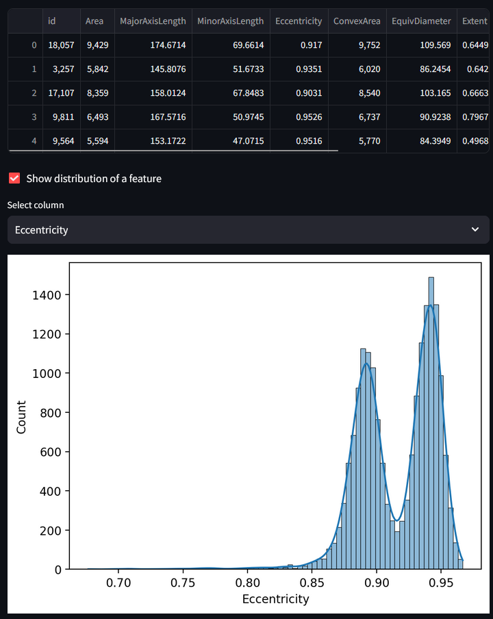
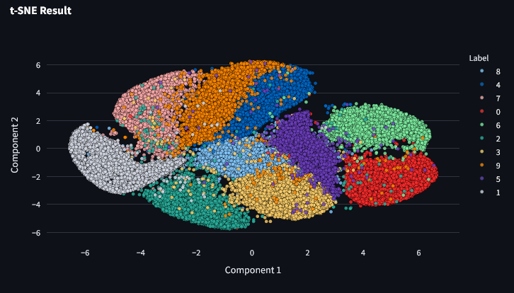
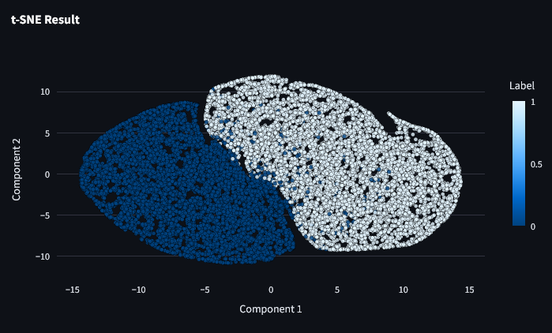
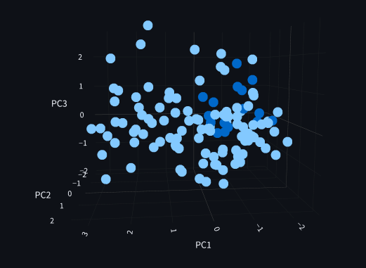
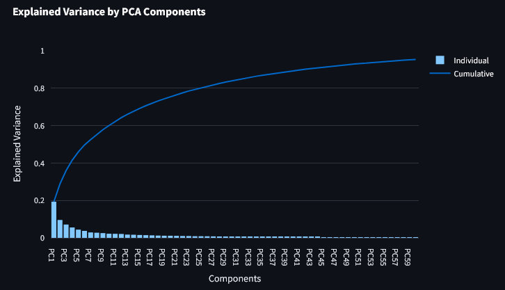
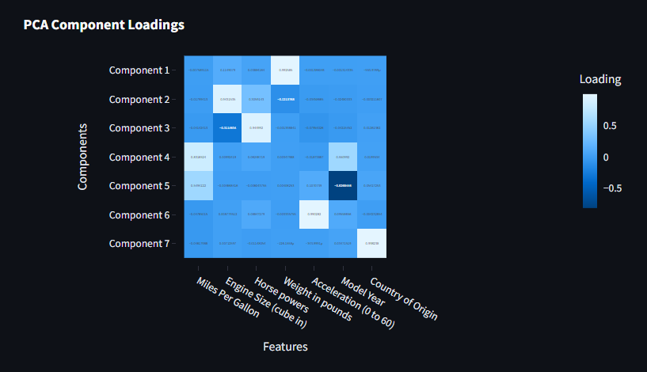
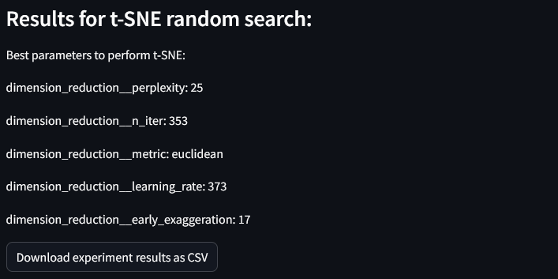

# Project Description and Contents

This project presents an interactive application tailored for advanced data visualization utilizing **state-of-the-art** techniques such as t-SNE, UMAP, TriMAP, and PaCMAP. 
Designed to cater to both beginners and experts in data science, the app offers robust functionality including data loading, dynamic visualization through real-time adjustments, data sampling, and the evaluation of various quality metrics. 
These features empower users to explore complex datasets comprehensively, providing insightful visual representations that facilitate better understanding and analysis of the data's underlying structure and relationships.

Authors: Kacper Sobczyk, Katarzyna Główczyk, Sebastian Hec

---

# Application Set Up

To run the application, you need to set up a Python environment, either locally or in a Docker container as specified in the Docker section.

## Python Environment Setup 
First, ensure you have a Python virtual environment set up and all dependencies installed. Once the virtual environment is active and all dependencies from requirements.txt are installed, you can run the application on your local machine using:
 ```
streamlit run app.py --server.port 8502
 ```
Your application should be accessible at http://localhost:8502

## Docker

Begin by building a Docker image from your Dockerfile. Open your terminal, navigate to the directory containing your Dockerfile, and run the following command (replace app with the name you want to give your Docker image):
 ```
docker build -t app .
 ```
After the image is built, you can run it as a container. To do so, use the following command:
 ```
docker run -p 8502:8502 app
 ```
Once the container is running, open a web browser and visit http://localhost:8502. You should see your Streamlit application running.

---


# Project Overview

1. **Load Dataset**




The initial page of our web application focuses on dataset loading and visualization, offering options to either choose from predefined datasets (e.g., MNIST, Fashion-MNIST, Scene Dataset) or upload custom datasets in CSV, XLSX, or XLS formats.
Custom 

Dataset Uploading

A user-friendly upload interface is activated when the "Upload Dataset" option is selected. This allows users to bring their specific data into the application for analysis.

Data Sampling

The application features a sampling slider, enabling users to specify the percentage of the dataset to load (ranging from 1% to 100%). This functionality is essential for handling large datasets efficiently by adjusting the sample size according to system capabilities or analytical needs.

Data Preview

After dataset selection and loading, the application displays a preview of the first few rows. Users can further explore the data through a feature distribution visualization option, which provides insights into the selected data column.



2. **Techniques Set Up and Visualization**

The second page of our web application focuses on the selection of dimensionality reduction techniques and the customization of their respective parameters. This allows users to tailor the data analysis process according to their specific needs and dataset characteristics.



Visual Feedback on Dataset Loading

At the beginning of the page, users receive visual confirmation of the dataset currently loaded, displayed prominently in a styled box. This feedback ensures that users are aware of the data context as they proceed with technique selection and parameter tuning.

Selection of Dimensionality Reduction Techniques

The page provides an expandable interface where users can select from multiple dimensionality reduction techniques: t-SNE, UMAP, TRIMAP, and PaCMAP. Each technique section offers a brief description and the option to activate the technique for the current session.



3. **PCA Components Analysis**

The third page of our application is dedicated to the Principal Component Analysis (PCA), enabling users to perform and visualize PCA on datasets they have loaded and configured. This page is structured to guide users through a systematic analysis, offering options for detailed component exploration and data visualization.

Feature Selection for PCA

Users can choose to perform PCA using all features of the dataset or select specific features. A checkbox activates a multi-select dropdown menu where specific features can be chosen. This flexibility allows for focused analysis on relevant features, potentially improving the clarity and relevance of the PCA results.
PCA Configuration

A slider allows users to choose the number of principal components they wish to analyze, with the maximum limit set by the smaller of the number of features or the number of data points to ensure a valid PCA computation.

PCA Execution and Visualization Options

Three checkboxes provide users with options to visualize different aspects of PCA:

* PCA Plot: Depending on the number of components selected (two or three), a 2D or 3D PCA plot is generated, providing a visual representation of data spread in the principal component space. 



* Explained Variance Plot: This plot shows the proportion of the dataset’s variance that each principal component accounts for, helping users understand the importance of each component. 



* Loadings Heatmap: A heatmap of PCA loadings can be generated, which is useful for identifying which variables contribute most to each principal component.



4. **Technique Tuning with RandomSearch**


# Result Interpretation

## Cluster Formation
- **Observation**: Clusters of data points in a 2D or 3D PCA scatter plot.
- **Interpretation**: Clusters indicate that PCA has successfully reduced the dimensionality of the data while preserving the variance. Each cluster may represent a different group, category, or class within the data. This can be useful for identifying natural groupings and patterns.

## Outliers Detection
- **Observation**: Data points that are distant from the main clusters in the scatter plot.
- **Interpretation**: These points can be considered outliers, indicating observations that significantly differ from the majority of the data. Identifying outliers is crucial for understanding the dataset's variability and can inform data cleaning and preprocessing steps.

## Class Overlap
- **Observation**: Overlapping clusters in the PCA plot.
- **Interpretation**: Overlap between clusters suggests that some classes or groups are not completely separable in the reduced dimensional space. This might imply that there are similarities between these groups or that the features used do not completely differentiate between them.

## Explained Variance (Components Analysis)
- **Observation**: Bar plot showing the explained variance of each principal component, often accompanied by a cumulative variance line plot.
- **Interpretation**: The explained variance plot shows how much variance each principal component captures. A steep rise at the beginning indicates that the first few components capture most of the variance, making them the most informative. The cumulative variance plot helps determine how many components are needed to capture a desired amount of total variance, indicating the effectiveness of the dimensionality reduction.

---
# DETAILS

## Characteristics of Used Techniques and Their Parameters

**t-SNE** (t-Distributed Stochastic Neighbor Embedding) is a technique that converts similarities between data points into joint probabilities and then minimizes the Kullback-Leibler divergence between these probabilities in both the high-dimensional and low-dimensional spaces. This makes it exceptionally good at creating a two- or three-dimensional map of datasets, revealing intrinsic patterns such as clusters. t-SNE is particularly sensitive to local structure and has a tendency to create distinct groups or clusters, making it useful for visualizing clusters of high-dimensional data.

**UMAP** (Uniform Manifold Approximation and Projection) operates under the assumption that the data is uniformly distributed on a locally connected Riemannian manifold and uses a fuzzy topological structure to project the data into a low-dimensional space. UMAP maintains both local and more global structure of the data better than t-SNE, often providing superior visualization outcomes for more complex datasets. It is generally faster than t-SNE and scales more favorably with the size of the input data.

**TriMAP** is another method that focuses on preserving the global relationships between data points alongside local ones, using triplet-based loss functions to guide the embedding. It selects triplets of points—consisting of an anchor, a near point, and a far point—and optimizes the layout to keep the relative distance consistent between the high-dimensional and the reduced space. This approach helps in maintaining the true geodesic distances among points, which is especially useful for datasets where global relationships are critical.

**PaCMAP** (Pairwise Controlled Manifold Approximation and Projection) is a relatively new method that also seeks to maintain a balance between local and global structures in the data. It uses pairwise constraints and controls the ratio of certain types of point pairs to steer the manifold learning process. This approach helps in reducing the tendency of clustering effect seen in methods like t-SNE, leading to a more uniform distribution of points in the embedded space, which can be more informative for certain types of analytical tasks.

## Paramethers
**t-SNE (t-Distributed Stochastic Neighbor Embedding) Parameters**
* n_components: Specifies the dimension of the output space; commonly set to 2 for visualization. 
* perplexity: Influences the number of nearest neighbors in the high-dimensional space, affecting local versus global data structure balance. 
* early_exaggeration: Amplifies differences in densities, helping to separate clusters more distinctly in the embedding. 
* learning_rate: Affects the step size at each iteration while minimizing the cost function, crucial for convergence of the algorithm. 
* n_iter: Sets the maximum number of optimization iterations, determining how long the algorithm runs. 
* metric: Determines the method used to measure distances between points in high-dimensional space, impacting the shape of the embedding.

**UMAP (Uniform Manifold Approximation and Projection) Parameters**
* n_neighbors: Controls the size of the local neighborhood considered for manifold approximation, crucial for capturing the data’s underlying structure. 
* n_components: Sets the dimensionality of the target embedding space, usually 2 for easy visualization. 
* min_dist: Regulates the tightness of the embedding, influencing how closely points can cluster together. 
* metric: Defines the distance metric for calculating dissimilarities between data points, which can dramatically affect the embedding's structure. 
* learning_rate: Adjusts the learning rate during optimization, important for effectively minimizing the embedding’s loss function.

**TriMAP Parameters**
* n_components: Indicates the dimensionality of the target projection space, with 2 being common for visual purposes. 
* n_inliers: Specifies the number of close points considered when forming triplet constraints, affecting local data structure preservation. 
* n_outliers: Determines the number of distant points used in triplet constraints, helping to maintain global data relationships. 
* n_random: Sets the number of random triplets per point, which can enhance the robustness of the manifold learning. 
* weight_adj: Adjusts the weight given to triplet constraints during optimization, balancing the emphasis on local versus global features. 
* n_iters: Dictates the number of iterations for optimizing the embedding, with more iterations potentially leading to better embeddings.

**PaCMAP (Pairwise Controlled Manifold Approximation and Projection) Parameters**
* n_components: Defines the number of dimensions in the reduced space, often set to 2 or 3 for visualization. 
* n_neighbors: Influences the manifold learning by specifying how many nearest neighbors to consider, similar to parameters in UMAP and t-SNE. 
* mn_ratio: Controls the ratio of medium-near to medium-far point pairs, adjusting the local versus global emphasis in the embedding. 
* fp_ratio: Sets the balance of far-positive pairs in the objective function, crucial for defining how distant relationships affect the embedding's structure.

##  Optimization of Technique Parameters (Random Search)

Random Search Hyperparameter Optimization



**Methodology:**
To begin, we define the range of possible values for each hyperparameter involved in the process. For t-SNE, important parameters include the number of iterations, learning rate, and perplexity, while for UMAP, we consider the number of neighbors, the distance metric, and the number of components. Following the establishment of these ranges, Random Search is employed to select hyperparameter combinations randomly. This method allows us to explore the hyperparameter space more broadly and randomly compared to traditional grid searches, potentially leading to better and more diverse solutions.

Each combination of hyperparameters is then applied to perform dimension reduction and visualization, and the outcomes are evaluated based on metrics that reflect the quality of visualization, including clarity, cluster separation, and the preservation of both local and global structures within the data.

## Description of the Used Metric (Conformity Fraction)

In our project focusing on dimension reduction and visualization, we employ the metric compute_cf to evaluate the conformity of data points with their nearest neighbors. This metric is derived from the results of compute_cf_nn, which computes the fraction of nearest neighbors that share the same label as the given data point.

```python
def compute_cf_nn(data_2d, labels, nn_max=100):
    data_2d = np.asarray(data_2d, dtype=np.float64)
    nbrs = NearestNeighbors(n_neighbors=nn_max, algorithm='auto').fit(data_2d)
    distances, indices = nbrs.kneighbors(data_2d)

    cf_nn_values = []
    for i in range(len(data_2d)):
        label = labels[i]
        neighbors_labels = labels[indices[i]]
        cf_nn = np.sum(neighbors_labels == label) / nn_max
        cf_nn_values.append(cf_nn)

    return np.array(cf_nn_values)


def compute_cf(cf_nn_values):
    return np.mean(cf_nn_values)
```

Result Interpretation

The result from compute_cf offers a quantifiable measure of how well clusters formed by the dimension reduction techniques (like t-SNE and UMAP) align with the actual labels of the data points. A higher compute_cf value indicates that, on average, data points are surrounded by neighbors with the same labels, suggesting effective clustering and meaningful dimensionality reduction.


Interpretation Scenarios:
* High compute_cf Value: This suggests that the dimension reduction technique has successfully grouped similar items (as per their labels) together. It indicates that the local neighborhoods are label-homogeneous, which is often desired in clustering scenarios.
* Low compute_cf Value: Conversely, a lower value might indicate that the dimension reduction has not preserved label neighborhoods well. This could be a signal to adjust hyperparameters or reconsider the suitability of the chosen method for the specific type of data.
